# AI Guest Response Agent

A production-quality AI agent that generates responses to guest accommodation inquiries.

## Features

- **Agentic Workflow**: LangGraph-based agent with conditional routing and parallel tool execution
- **Multi-Tool System**: Template retrieval (RAG), property details, and reservation lookups
- **Safety Guardrails**: PII redaction and topic filtering with fast-path optimization
- **Production Monitoring**: LangSmith tracing, Prometheus metrics, Grafana dashboards
- **Cost Optimization**: Template-first strategy, direct template substitution (skips LLM), multi-layer caching
- **Latency Optimization**: Topic filter fast-path, embedding cache warming, trigger-query embeddings
- **Comprehensive Testing**: Unit, integration, and E2E tests
- **Docker Deployment**: Full stack deployment with Docker Compose

## Architecture

### Agent Workflow

```mermaid
graph LR
    Start([Guest Message]) --> Guardrails[Apply Guardrails<br/>Detect & Redact PII<br/>Topic Filter ⚡]

    Guardrails -->|Topic Allowed?| Decision{Guardrail Check}

    Decision -->|Rejected| NoResponse[No Response<br/>Polite Decline]
    Decision -->|Approved| Tools[Execute Tools]

    Tools --> T1[Template Retrieval<br/>Qdrant ⚡]
    Tools --> T2[Property Details]
    Tools --> T3[Reservation Details]

    T1 --> Merge[Merge Results]
    T2 --> Merge
    T3 --> Merge

    Merge --> ResponseDecision{Template<br/>Score ≥ 0.70?}

    ResponseDecision -->|Yes| DirectCheck{All Placeholders<br/>Fillable?}
    ResponseDecision -->|No| CustomResponse[Custom Response<br/>Groq LLaMA 3.1]

    DirectCheck -->|Yes| DirectTemplate[Direct Template<br/>No LLM Call]
    DirectCheck -->|No| TemplateResponse[Template Response<br/>Groq LLaMA 3.1]

    NoResponse --> End([Return Response])
    DirectTemplate --> End
    TemplateResponse --> End
    CustomResponse --> End

    %% Entry / Exit
    style Start fill:#E5E7EB,stroke:#374151,stroke-width:1.5px,color:#111827
    style End fill:#E5E7EB,stroke:#374151,stroke-width:1.5px,color:#111827

    %% Guardrails / Safety
    style Guardrails fill:#FFEDD5,stroke:#C2410C,stroke-width:1.5px,color:#111827
    style NoResponse fill:#FECACA,stroke:#B91C1C,stroke-width:1.5px,color:#111827

    %% Decisions
    style Decision fill:#DBEAFE,stroke:#1D4ED8,stroke-width:1.5px,color:#111827
    style ResponseDecision fill:#DBEAFE,stroke:#1D4ED8,stroke-width:1.5px,color:#111827
    style DirectCheck fill:#DBEAFE,stroke:#1D4ED8,stroke-width:1.5px,color:#111827

    %% Tool execution
    style Tools fill:#EDE9FE,stroke:#6D28D9,stroke-width:1.5px,color:#111827
    style T1 fill:#EDE9FE,stroke:#6D28D9,stroke-width:1.2px,color:#111827
    style T2 fill:#EDE9FE,stroke:#6D28D9,stroke-width:1.2px,color:#111827
    style T3 fill:#EDE9FE,stroke:#6D28D9,stroke-width:1.2px,color:#111827
    style Merge fill:#DDD6FE,stroke:#6D28D9,stroke-width:1.5px,color:#111827

    %% Successful responses
    style DirectTemplate fill:#A7F3D0,stroke:#047857,stroke-width:1.5px,color:#111827
    style TemplateResponse fill:#D1FAE5,stroke:#047857,stroke-width:1.5px,color:#111827
    style CustomResponse fill:#D1FAE5,stroke:#047857,stroke-width:1.5px,color:#111827


```



## Tech Stack

| Component | Technology |
|-----------|------------|
| Agent Framework | LangGraph |
| LLM | Groq (LLaMA 3.1 8B Instant) |
| Embeddings | OpenAI text-embedding-3-small |
| Vector DB | Qdrant |
| API | FastAPI |
| Monitoring | LangSmith + Prometheus + Grafana |
| Deployment | Docker Compose |

## Quick Start

### Prerequisites

- Python 3.11+
- Docker and Docker Compose
- OpenAI API key
- Groq API key
- LangSmith API key (optional)

### 1. Clone and Setup

```bash
git clone <repository-url>
cd agentic-project

# Sync dependencies (creates .venv automatically)
uv sync

# For development tools
uv sync --extra dev

# Activate virtual environment
source .venv/bin/activate  # On Windows: .venv\Scripts\activate
```

### 2. Configure Environment

```bash
# Copy example environment file
cp .env.example .env

# Edit .env and add your API keys
# Required:
#   - OPENAI_API_KEY
#   - GROQ_API_KEY
# Optional:
#   - LANGSMITH_API_KEY
```

### 3. Start Services

```bash
# Start Qdrant and monitoring stack
docker-compose up -d qdrant prometheus grafana

# Wait for services to be ready
sleep 10
```

### 4. Generate Data and Setup

```bash
# Generate synthetic data (500 templates, 100 properties, 200 reservations)
python scripts/generate_synthetic_data.py

# Index templates in Qdrant
python scripts/setup_qdrant.py
```

### 5. Run the Application

```bash
# Development mode
python src/main.py

# Or with Docker Compose (full stack)
docker-compose up
```

### 6. Test the API

```bash
# Health check
curl http://localhost:8000/health

# Generate a response
curl -X POST http://localhost:8000/api/v1/generate-response \
  -H "Content-Type: application/json" \
  -d '{
    "message": "What time is check-in?",
    "property_id": "prop_001"
  }'

# View Swagger docs
open http://localhost:8000/docs
```

## Access Monitoring

- **API**: http://localhost:8000
- **Swagger Docs**: http://localhost:8000/docs
- **Prometheus**: http://localhost:9090
- **Grafana**: http://localhost:3000 (admin/admin)
- **Qdrant**: http://localhost:6333/dashboard
- **LangSmith**: https://smith.langchain.com

## Project Structure

```
agentic-project/
├── src/
│   ├── agent/              # LangGraph agent
│   │   ├── graph.py        # Workflow definition
│   │   ├── state.py        # State schema
│   │   ├── nodes.py        # Graph nodes
│   │   └── prompts.py      # Versioned prompts
│   ├── tools/              # Agent tools (incl. template_substitution)
│   ├── guardrails/         # Safety mechanisms (PII, topic filter with fast-path)
│   ├── api/                # FastAPI application
│   ├── retrieval/          # Vector DB operations
│   ├── monitoring/         # Observability
│   ├── data/               # Data layer (incl. cache warming)
│   └── config/             # Configuration
├── data/                   # Synthetic dataset
├── evaluation/             # Eval framework
├── tests/                  # Tests
├── infrastructure/         # Prometheus/Grafana config
└── scripts/                # Setup scripts
```

## Response Generation Strategy

The agent uses a three-tier response strategy to optimize for both quality and cost:

| Response Type | Condition | LLM Call | Description |
|---------------|-----------|----------|-------------|
| **Direct Template** | Score ≥ 0.80 + all placeholders fillable | No | High-confidence matches skip LLM entirely. Placeholders are substituted with live property/reservation data. |
| **Template Response** | Score ≥ 0.70 + missing placeholders | Yes | Good matches use templates as context for LLM generation. |
| **Custom Response** | Score < 0.70 | Yes | Low matches generate fully custom responses. |

### Trigger-Query Embeddings

Templates are indexed using **trigger queries** rather than response text, enabling query-to-query semantic matching. This produces high similarity scores (0.85-1.00) for common accommodation queries, making the direct template path highly effective.

### Direct Template Substitution

For high-confidence template matches, the system performs runtime placeholder substitution:

- Templates contain placeholders like `{check_in_time}`, `{guest_name}`, `{property_name}`
- The system builds context from property and reservation data
- If all placeholders can be filled, the response is returned directly without an LLM call
- This eliminates LLM latency for the majority of common queries

Configure via environment variables:
```bash
DIRECT_SUBSTITUTION_THRESHOLD=0.80   # Score threshold for direct substitution
RETRIEVAL_SIMILARITY_THRESHOLD=0.70  # Score threshold for template matching
```

## Testing

```bash
# Run all tests
pytest

# Run with coverage
pytest --cov=src --cov-report=html

# Run specific test categories
pytest tests/unit/
pytest tests/integration/
pytest tests/e2e/
```

## Performance

### Measured Latency (n=35 queries)

| Metric | Value |
|--------|-------|
| **Average** | 1.07s |
| **p50** | 0.09s |
| **p99** | 5.03s |
| **Min** | 0.01s |
| **Max** | 5.03s |

| Speed Tier | Count | Percentage |
|------------|-------|------------|
| Fast (<1s) | 21 | 60% |
| Medium (1-3s) | 9 | 26% |
| Slow (>3s) | 5 | 14% |

### Latency by Component

| Component | Avg Latency | Max Latency |
|-----------|-------------|-------------|
| Full Request (LangGraph) | 2.22s | 5.03s |
| LLM Call (Groq) | 1.45s | 4.48s |
| Response Generation | 1.05s | 4.50s |
| Guardrails | 0.73s | 3.45s |
| Tool Execution | 0.59s | 1.16s |

### Optimizations

The agent includes several optimizations for low-latency responses:

**Topic Filter Fast-Path**: For common safe queries (check-in times, amenities, parking, etc.), the topic filter uses regex pattern matching (~90ms) instead of an LLM call, reducing guardrails latency significantly.

**Embedding Cache Warming**: At startup, embeddings for 54 common queries are pre-generated in a single batch API call. Cached queries skip the embedding API call entirely.

**Trigger-Query Embeddings**: Templates are indexed by trigger queries, enabling high-confidence semantic matches (0.85-1.00 similarity scores) that qualify for direct template substitution.

### Latency by Path

| Query Path | Typical Latency |
|------------|-----------------|
| Cache hit + fast-path + direct template | ~90ms (p50) |
| Cache miss + fast-path + direct template | ~500ms |
| Fast-path + LLM response | ~2-3s |
| LLM guardrails + LLM response | ~5s |

## Metrics

The agent tracks the following via Prometheus:

| Category | Metrics |
|----------|---------|
| **Quality** | Relevance score, accuracy score, safety score |
| **Performance** | P50/P95/P99 latency, tokens per request |
| **Cost** | Cost per response, template match rate, direct substitution rate |
| **Operational** | Error rate, cache hit rate, guardrail triggers, topic filter path (fast_path/llm), direct substitution status (success/fallback) |

## Development

```bash
# Format code
black src/ tests/

# Lint
ruff check src/ tests/

# Type checking
mypy src/
```

## Production Deployment

```bash
# Build and deploy full stack
docker-compose up -d

# View logs
docker-compose logs -f api

# Scale the API
docker-compose up -d --scale api=3
```

## License

MIT

## Author

Pranav Tyagi
