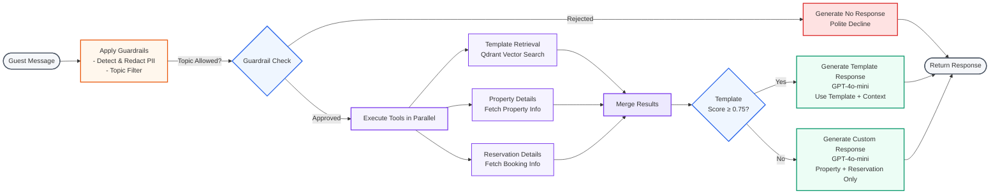

# AI Guest Response Agent

A production-quality AI agent that generates responses to guest accommodation inquiries. This project demonstrates AI Engineering and MLOps expertise through LangGraph orchestration, multi-tool agentic workflows, comprehensive evaluation, and production monitoring.

## Features

- **Agentic Workflow**: LangGraph-based agent with conditional routing and parallel tool execution
- **Multi-Tool System**: Template retrieval (RAG), property details, and reservation lookups
- **Safety Guardrails**: PII redaction and topic filtering
- **Production Monitoring**: LangSmith tracing, Prometheus metrics, Grafana dashboards
- **Cost Optimization**: Template-first strategy, multi-layer caching (40-60% cost reduction)
- **Comprehensive Testing**: Unit, integration, and E2E tests
- **Docker Deployment**: Full stack deployment with Docker Compose

## Architecture

### Agent Workflow



## Tech Stack

| Component | Technology |
|-----------|------------|
| Agent Framework | LangGraph |
| LLM | DeepSeek-V3.2 |
| Embeddings | OpenAI text-embedding-3-small |
| Vector DB | Qdrant |
| API | FastAPI |
| Monitoring | LangSmith + Prometheus + Grafana |
| Deployment | Docker Compose |

## Quick Start

### Prerequisites

- Python 3.11+
- Docker and Docker Compose
- OpenAI API key
- DeepSeek API key
- LangSmith API key (optional)

### 1. Clone and Setup

```bash
git clone <repository-url>
cd agentic-project

# Create virtual environment
python -m venv .venv
source .venv/bin/activate  # On Windows: .venv\Scripts\activate

# Install dependencies
uv pip install -e .

# For development tools
uv pip install -e ".[dev]"
```

### 2. Configure Environment

```bash
# Copy example environment file
cp .env.example .env

# Edit .env and add your API keys
# Required:
#   - OPENAI_API_KEY
#   - DEEPSEEK_API_KEY
# Optional:
#   - LANGSMITH_API_KEY
```

### 3. Start Services

```bash
# Start Qdrant and monitoring stack
docker-compose up -d qdrant prometheus grafana

# Wait for services to be ready
sleep 10
```

### 4. Generate Data and Setup

```bash
# Generate synthetic data (500 templates, 100 properties, 200 reservations)
python scripts/generate_synthetic_data.py

# Index templates in Qdrant
python scripts/setup_qdrant.py
```

### 5. Run the Application

```bash
# Development mode
python src/main.py

# Or with Docker Compose (full stack)
docker-compose up
```

### 6. Test the API

```bash
# Health check
curl http://localhost:8000/health

# Generate a response
curl -X POST http://localhost:8000/api/v1/generate-response \
  -H "Content-Type: application/json" \
  -d '{
    "message": "What time is check-in?",
    "property_id": "prop_001"
  }'

# View Swagger docs
open http://localhost:8000/docs
```

## Access Monitoring

- **API**: http://localhost:8000
- **Swagger Docs**: http://localhost:8000/docs
- **Prometheus**: http://localhost:9090
- **Grafana**: http://localhost:3000 (admin/admin)
- **Qdrant**: http://localhost:6333/dashboard
- **LangSmith**: https://smith.langchain.com

## Project Structure

```
agentic-project/
├── src/
│   ├── agent/              # LangGraph agent
│   │   ├── graph.py        # Workflow definition
│   │   ├── state.py        # State schema
│   │   ├── nodes.py        # Graph nodes
│   │   └── prompts.py      # Versioned prompts
│   ├── tools/              # Agent tools
│   ├── guardrails/         # Safety mechanisms
│   ├── api/                # FastAPI application
│   ├── retrieval/          # Vector DB operations
│   ├── monitoring/         # Observability
│   ├── data/               # Data layer
│   └── config/             # Configuration
├── data/                   # Synthetic dataset
├── evaluation/             # Eval framework
├── tests/                  # Tests
├── infrastructure/         # Prometheus/Grafana config
└── scripts/                # Setup scripts
```

## Testing

```bash
# Run all tests
pytest

# Run with coverage
pytest --cov=src --cov-report=html

# Run specific test categories
pytest tests/unit/
pytest tests/integration/
pytest tests/e2e/
```

## Key Metrics

The agent tracks:
- **Quality**: Relevance, accuracy, safety scores
- **Performance**: P50/P95/P99 latency, tokens/request
- **Cost**: Cost per response, template match rate
- **Operational**: Error rate, cache hit rate, guardrail triggers

## Development

```bash
# Format code
black src/ tests/

# Lint
ruff check src/ tests/

# Type checking
mypy src/
```

## Production Deployment

```bash
# Build and deploy full stack
docker-compose up -d

# View logs
docker-compose logs -f api

# Scale the API
docker-compose up -d --scale api=3
```

## License

MIT

## Author

Pranav Tyagi - AI Engineer Portfolio Project
