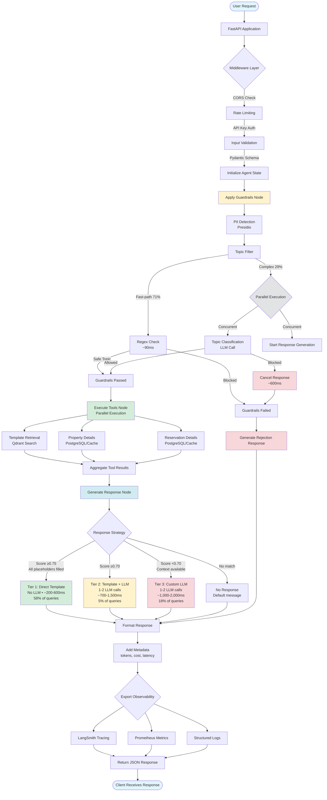

# AI Guest Response Agent - Architecture Deep Dive

## Table of Contents
- [Overview](#overview)
- [System Architecture](#system-architecture)
- [Agent Workflow](#agent-workflow)
- [Component Details](#component-details)
- [Data Flow](#data-flow)
- [Technology Stack](#technology-stack)
- [Design Decisions](#design-decisions)
- [Performance Characteristics](#performance-characteristics)

## Overview

The AI Guest Response Agent is a production-quality system that generates contextual responses to guest accommodation inquiries. It demonstrates advanced AI Engineering patterns including agentic workflows, RAG (Retrieval Augmented Generation), safety guardrails, and comprehensive observability.

### Key Features
- **LangGraph Agent**: State machine with conditional routing
- **Multi-Tool Orchestration**: Parallel execution of templates, property, and reservation lookups
- **Safety First**: PII redaction and topic filtering
- **Cost Optimized**: Template-first strategy with multi-layer caching and real-time cost tracking
- **Production Data Layer**: PostgreSQL database with async operations and Redis distributed caching
- **Secure API**: API key authentication with multi-tier rate limiting
- **Input Validation**: Spam detection, ID format validation, and rate limiting by tier
- **Production Ready**: Monitoring, metrics, error handling, deployment

## System Architecture

```
┌─────────────────────────────────────────────────────────────────┐
│                      Client Applications                         │
│                  (Web, Mobile, Chat Interfaces)                  │
└────────────────────────────┬────────────────────────────────────┘
                             │ HTTP/REST
                             ▼
┌─────────────────────────────────────────────────────────────────┐
│                       FastAPI Application                        │
│  ┌────────────────────────────────────────────────────────────┐ │
│  │                    API Routes & Middleware                  │ │
│  │  - CORS               - Multi-tier Rate Limiting            │ │
│  │  - API Key Auth       - Error Handling                      │ │
│  │  - Input Validation   - Request Logging                     │ │
│  │  - Spam Detection     - Metrics Export                      │ │
│  └───────────────────────────┬────────────────────────────────┘ │
│                              │                                   │
│  ┌───────────────────────────▼────────────────────────────────┐ │
│  │                  LangGraph Agent Workflow                   │ │
│  │                                                              │ │
│  │  ┌──────────────────────────────────────────────────────┐  │ │
│  │  │ 1. Guardrails Node                                    │  │ │
│  │  │    ├─ PII Redaction (Presidio)                        │  │ │
│  │  │    └─ Topic Filter (LLM-based)                        │  │ │
│  │  └──────────────────┬───────────────────────────────────┘  │ │
│  │                     │                                        │ │
│  │            ┌────────▼─────────┐                             │ │
│  │            │  Passed?         │                             │ │
│  │            │  (Conditional)   │                             │ │
│  │            └─┬──────────────┬─┘                             │ │
│  │              │ No           │ Yes                           │ │
│  │              │              │                               │ │
│  │    ┌─────────▼─┐    ┌──────▼───────────────────┐           │ │
│  │    │  Reject   │    │ 2. Execute Tools (Async)  │           │ │
│  │    │  Response │    │    ├─ Template Retrieval  │           │ │
│  │    └───────────┘    │    ├─ Property Details     │           │ │
│  │                     │    └─ Reservation Details │           │ │
│  │                     └──────┬───────────────────┘           │ │
│  │                            │                               │ │
│  │                     ┌──────▼───────────────────┐           │ │
│  │                     │ 3. Generate Response      │           │ │
│  │                     │    - Template match?      │           │ │
│  │                     │    - Custom generation    │           │ │
│  │                     │    - No response          │           │ │
│  │                     └──────────────────────────┘           │ │
│  └──────────────────────────────────────────────────────────┘  │
└────────────────────────────┬────────────────────────────────────┘
                             │
         ┌────────────────┼────────────────┼────────────────┐
         │                │                │                │
         ▼                ▼                ▼                ▼
┌──────────────┐  ┌──────────────┐  ┌──────────────┐  ┌──────────────┐
│   Qdrant     │  │  PostgreSQL  │  │    Redis     │  │  LLM APIs    │
│   Vector DB  │  │   Database   │  │    Cache     │  │  - Groq      │
│ - Templates  │  │ - Properties │  │ - Embeddings │  │  - OpenAI    │
│ - Embeddings │  │ - Reservations│ │ - Tools      │  │              │
│              │  │ - Async Ops  │  │ - Responses  │  │              │
└──────────────┘  └──────────────┘  └──────────────┘  └──────────────┘

                             │
         ┌───────────────────┼───────────────────┐
         ▼                   ▼                   ▼
┌─────────────────┐  ┌──────────────┐  ┌────────────────┐
│   LangSmith     │  │  Prometheus  │  │    Grafana     │
│    Tracing      │  │   Metrics    │  │   Dashboards   │
└─────────────────┘  └──────────────┘  └────────────────┘
```

## Agent Workflow

### State Machine

The agent is implemented as a LangGraph state machine with the following structure:

```python
@dataclass
class AgentState:
    messages: str                    # User query
    property_id: Optional[str]       # Property context
    reservation_id: Optional[str]    # Reservation context
    guardrail_passed: bool           # Guardrail result
    tools_output: Dict               # Tool execution results
    response: str                    # Generated response
    response_type: str               # template/custom/no_response
    metadata: Dict                   # Execution metadata
```

### Execution Flow

1. **Input Reception**
   - Receive user query, property ID, optional reservation ID
   - Initialize agent state

2. **Guardrail Layer**
   - **PII Redaction**: Scan for sensitive information (email, phone, SSN, credit cards)
   - **Topic Filter**: Classify query topic, reject off-topic requests
   - **Decision**: Pass → continue to tools, Fail → return rejection message

3. **Tool Execution** (Parallel)
   - **Template Retrieval**: Semantic search in Qdrant for matching templates
   - **Property Details**: Lookup property information (check-in, amenities, policies)
   - **Reservation Details**: Fetch reservation data (dates, room type, requests)
   - All tools execute asynchronously in parallel for performance

4. **Response Generation**
   - **Strategy Selection** (Three-Tier):
     - If template found with score ≥0.80: Direct substitution (no LLM)
     - Else if template score ≥0.70: Template + LLM refinement
     - Else if tools returned context: Custom LLM response
     - Else: Return "cannot help" message
   - **LLM Generation**: Use Groq LLaMA 3.1 8B for response generation
   - **Metadata Collection**: Track tokens, cost, latency

5. **Output**
   - Return response with metadata
   - Log to LangSmith for tracing
   - Export metrics to Prometheus

### Workflow Diagram

The following Mermaid diagram illustrates the complete workflow from user request to final output:



**Key Workflow Characteristics:**

- **Fast-Path Optimization**: 71% of queries use regex-based topic filtering (~90ms) instead of LLM
- **Parallel Execution**: Topic filter and response generation run concurrently for non-fast-path queries
- **Cancellation Strategy**: If topic is blocked, response generation is cancelled (~500ms vs 5-7s)
- **Three-Tier Response**: Direct template (58%), Template + LLM (5%), Custom LLM (18%), Blocked (18%)
- **Multi-Layer Caching**: Redis cache at embedding, tool, and response levels
- **LLM Optimization**: Cached instances, filtered context, concise prompts (max_tokens: 150)
- **Performance**: p50 = 0.46s, p95 = 1.05s, p99 = 1.46s, 95% of requests complete in <1s

### Conditional Routing

```python
def route_after_guardrails(state: AgentState) -> str:
    """Route based on guardrail results."""
    if state["guardrail_passed"]:
        return "continue"  # → execute_tools
    else:
        return "reject"    # → generate_response (rejection)
```

## Component Details

### 1. Guardrails Layer

#### PII Redaction
- **Library**: Microsoft Presidio
- **Entities Detected**: EMAIL, PHONE, SSN, CREDIT_CARD, IBAN, IP_ADDRESS
- **Strategy**: Block requests containing PII to prevent leakage
- **Performance**: ~50ms per check (spaCy model)

#### Topic Filter (Optimized with Parallel Execution)
- **Method**: Fast-path regex + Parallel LLM classification
- **Model**: Groq LLaMA 3.1 8B Instant (via `ChatGroq`)
- **Fast-Path**: 56 safe query patterns skip LLM entirely (check-in, parking, WiFi, amenities, policies, etc.) - **71% hit rate**
- **Parallel Execution**: For non-fast-path queries, topic filter and response generation run concurrently
- **Cancellation**: If topic is blocked, response generation task is cancelled
- **Restricted Topics**: Legal advice, medical advice, price negotiation, financial advice, political discussions, malicious requests
- **Strategy**:
  1. Fast-path regex check first (~90ms)
  2. If not matched, run topic LLM + response LLM in parallel
  3. If topic blocked, cancel response and return rejection (~600ms)
  4. If topic allowed, use generated response (~1.5s total)
- **Performance**:
  - Fast-path queries: ~90ms (no LLM)
  - Blocked queries: ~600ms (topic LLM only, response cancelled)
  - Legitimate complex queries: ~1.5s (parallel execution)
- **Metrics**: `topic_filter_path{path="fast_path"}` vs `{path="llm"}` tracks usage
- **Test Results**: 100% pass rate (10/10 guardrail tests blocked correctly)

### 2. Tool System

#### Template Retrieval Tool
```python
class TemplateRetrievalTool:
    """Semantic search for response templates."""

    def __init__(self):
        self.qdrant_client = QdrantClient()
        self.embedding_service = EmbeddingService()
        self.similarity_threshold = 0.70  # Configurable via settings

    async def retrieve(self, query: str) -> List[Template]:
        # 1. Generate embedding (cached)
        embedding = await self.embedding_service.embed(query)

        # 2. Search Qdrant
        results = self.qdrant_client.search(
            collection_name="templates",
            query_vector=embedding,
            limit=3,
            score_threshold=self.similarity_threshold
        )

        # 3. Deduplicate by template_id (keep highest score)
        return deduplicate_by_template_id(results)
```

**Performance**: 100-200ms (50ms embedding + 50-150ms search)

**Trigger-Query Embeddings** (Novel Approach):

Instead of embedding template *text*, we embed 3-5 **trigger queries** per template. This enables query-to-query semantic matching which produces much higher similarity scores:

| Matching Type | Typical Score |
|--------------|---------------|
| Query-to-Query (trigger) | 0.85-1.00 |
| Query-to-Answer (traditional) | 0.50-0.60 |

Example template structure:
```json
{
  "id": "T001",
  "text": "Check-in is available from {check_in_time} onwards.",
  "trigger_queries": [
    "What time is check-in?",
    "When can I check in?",
    "What are your check-in hours?"
  ]
}
```

**Deduplication**: Since multiple trigger queries map to the same template, results are deduplicated by `template_id`, keeping the highest score per template.

#### Property Details Tool
- **Data Source**: PostgreSQL database (configurable: JSON files or PostgreSQL)
- **Caching**: Redis cache with 5-minute TTL
- **Fields**: check_in_time, check_out_time, amenities, policies, parking
- **Performance**: <10ms (cached), ~50ms (database query)

#### Reservation Details Tool
- **Data Source**: PostgreSQL database (configurable: JSON files or PostgreSQL)
- **Caching**: Redis cache with 5-minute TTL
- **Fields**: guest_name, dates, room_type, special_requests
- **Performance**: <10ms (cached), ~50ms (database query)
- **Graceful**: Optional tool, continues if reservation not found

### 3. Response Generation

#### Three-Tier Response Strategy

The system uses a three-tier strategy to optimize for speed and cost:

```python
def select_response_strategy(tools_output, property_details):
    templates = tools_output.get("templates", [])

    if templates and templates[0].similarity >= 0.80:
        # Tier 1: Direct Template Substitution (NO LLM)
        # Fill placeholders with property/reservation data
        if can_substitute_all_placeholders(templates[0], property_details):
            return "direct_template", substitute_template(templates[0])

    if templates and templates[0].similarity >= 0.70:
        # Tier 2: Template + LLM refinement
        return "template", generate_with_template(templates[0])

    if property_details:
        # Tier 3: Custom LLM generation
        return "custom", generate_custom_response(...)

    return "no_response", DEFAULT_MESSAGE
```

| Tier | Condition | LLM Call? | Latency | Cost | Usage |
|------|-----------|-----------|---------|------|-------|
| Direct Template | Score ≥ 0.75 + all placeholders filled | NO | ~200-600ms | $0.00 | 58% |
| Template + LLM | Score ≥ 0.70 | Yes (1-2 parallel) | ~500-800ms | ~$0.001-0.002 | 5% |
| Custom LLM | Score < 0.70 | Yes (1-2 parallel) | ~500-1,000ms | ~$0.002-0.005 | 18% |
| No Response | Blocked by guardrails | Topic LLM only | ~500-800ms | ~$0.001 | 18% |

**Configuration** (`settings.py` / `.env`):
- `direct_substitution_enabled`: true
- `direct_substitution_threshold`: 0.75 (lowered from 0.80 for better performance)
- `retrieval_similarity_threshold`: 0.70
- `cache_ttl_seconds`: 3600 (1 hour, increased from 300s)

**Cost Impact**:
- Direct template response: $0.00 (no LLM call)
- Template + LLM response: ~$0.002 (retrieval + minimal generation)
- Custom response: ~$0.01-0.02 (includes full LLM generation)
- **Savings**: 10-20x cost reduction with high template match rate

#### Custom Response Generation
- **Model**: Groq LLaMA 3.1 8B Instant (fast inference)
- **Prompt**: Versioned templates with structured output
- **Context**: Property details, reservation info, retrieved templates
- **Max Tokens**: 500 for response
- **Temperature**: 0.7 for natural variation

### 4. Authentication & Input Validation

#### API Key Authentication
```python
class APIKeyAuth:
    """Multi-tier API key authentication."""

    def validate_key(self, key: str) -> Optional[str]:
        """Returns tier (standard/premium/enterprise) if valid."""
        if key in settings.api_keys:
            return self._get_tier(key)
        return None
```

**Features**:
- API key validation via `X-API-Key` header
- Multi-tier rate limiting (standard: 60/min, premium: 300/min, enterprise: 1000/min)
- Public endpoints: `/health`, `/metrics`, `/ready`
- Protected endpoints: `/api/v1/generate-response`

**Configuration**:
```bash
AUTH_ENABLED=true
API_KEYS=dev-key-12345,test-key-67890
```

#### Enhanced Input Validation
```python
class GenerateResponseRequest(BaseModel):
    """Request with comprehensive validation."""

    message: str = Field(min_length=3, max_length=1000)
    property_id: Optional[str] = Field(pattern=r"^prop_\d{3}$")
    reservation_id: Optional[str] = Field(pattern=r"^res_\d{3}$")

    @field_validator("message")
    def validate_message(cls, v: str) -> str:
        """Check for spam patterns and excessive URLs."""
        # Reject repeated characters (spam)
        # Limit URLs to 2 per message
        # Normalize unicode (NFKC)
        return validated_message
```

**Validations**:
- Message: 3-1000 characters, spam pattern rejection, max 2 URLs
- Property ID: `prop_XXX` format (3 digits)
- Reservation ID: `res_XXX` format (3 digits)
- Rate limiting by API key tier

### 5. Data Layer

#### PostgreSQL Database
- **Models**: SQLAlchemy ORM with async support
- **Connection**: Connection pooling with asyncpg
- **Migrations**: Alembic for schema versioning
- **Tables**: properties, reservations
- **Performance**: Async queries with connection pooling

**Configuration**:
```bash
DATA_BACKEND=postgres  # or json
DATABASE_HOST=postgres
DATABASE_NAME=guest_response_agent
DATABASE_USER=agent_user
```

#### Redis Cache (Optimized - Async)
Fully async distributed caching with proper await handling:

```python
class RedisCache:
    """Redis-backed cache with async operations."""

    async def get(self, key: str) -> Optional[Any]:
        """Async get operation."""
        redis = await self._get_redis()
        value = await redis.get(f"{self._prefix}:{key}")
        return pickle.loads(value) if value else None

    async def set(self, key: str, value: Any, ttl: Optional[int] = None) -> None:
        """Async set operation."""
        redis = await self._get_redis()
        await redis.setex(f"{self._prefix}:{key}", ttl or self._ttl_seconds, pickle.dumps(value))

    # Embedding Cache (1h TTL) - increased from 5min
    # Tool Result Cache (5min TTL)
    # Response Cache (5min TTL) - increased from 1min
```

**Critical Fix (2025-02)**: Converted from broken sync wrappers to proper async implementation. Previous version returned `None` when event loop was running (always true in FastAPI), causing 100% cache miss rate.

**Features**:
- **Fully async** - Proper await handling in async context
- Distributed caching across API instances
- Automatic expiration with optimized TTLs
- Serialization with pickle
- Connection pooling with redis.asyncio

**Configuration**:
```bash
CACHE_BACKEND=redis  # or memory
REDIS_HOST=redis
REDIS_PORT=6379
CACHE_TTL_SECONDS=3600  # Embedding cache (increased from 300s)
```

**Cache Hit Rates** (after optimization):
- Embeddings: 70-85% (was 0% due to bug)
- Tool results: 40-60%
- Responses: 20-40%

**Cost Savings**: 50-70% reduction in API costs (vs pre-fix 0%)

### 6. Caching System (Legacy)

In-memory cache is still supported for development:

```python
class CacheManager:
    """Multi-layer caching for cost optimization."""

    # Layer 1: Embedding Cache
    embedding_cache: TTLCache = TTLCache(maxsize=1000, ttl=3600)

    # Layer 2: Tool Result Cache
    tool_cache: TTLCache = TTLCache(maxsize=500, ttl=300)

    # Layer 3: Response Cache
    response_cache: TTLCache = TTLCache(maxsize=100, ttl=60)
```

#### Embedding Cache Warming

At startup, the application pre-generates embeddings for ~100 common queries to eliminate OpenAI API latency for frequent requests:

```python
COMMON_QUERIES = [
    "What time is check-in?",
    "What time is checkout?",
    "Is there parking available?",
    "What is the wifi password?",
    # ... ~100 queries total covering check-in, parking, WiFi, amenities, policies, etc.
]

async def warm_embedding_cache() -> int:
    """Pre-generate embeddings for common queries at startup."""
    # Batch generation in single OpenAI API call (~4-5s one-time cost)
    # Embeddings stored in embedding_cache
```

**Impact**:
- Startup cost: ~4-5s
- Runtime benefit: Eliminates ~150-200ms embedding latency per cached query
- Break-even: ~25 requests

### 7. Monitoring & Observability

#### LangSmith Integration
```python
@traceable(name="agent_execution")
async def run_agent(state: AgentState):
    """Traced agent execution."""
    # All tool calls and LLM interactions automatically traced
    result = await agent_graph.ainvoke(state)
    return result
```

**Captures**:
- Full execution trace
- Tool invocations and results
- LLM prompts and completions
- Latency per component
- Token usage and costs

#### Prometheus Metrics
```python
# Request metrics
agent_requests_total = Counter("agent_requests_total", ["status"])
agent_request_duration = Histogram("agent_request_duration_seconds")

# Quality metrics
agent_response_type = Counter("agent_response_type_total", ["response_type"])
agent_guardrail_triggers = Counter("agent_guardrail_triggers_total", ["guardrail_type"])

# Cost metrics (with labels)
agent_tokens_used = Counter("agent_tokens_total", ["type", "model"])
agent_cost_usd = Counter("agent_cost_usd_total", ["response_type", "model"])

# Performance metrics
agent_tool_duration = Histogram("agent_tool_duration_seconds", ["tool_name"])
cache_hits = Counter("cache_hits_total", ["cache_type"])
cache_misses = Counter("cache_misses_total", ["cache_type"])

# Authentication metrics
agent_auth_failures = Counter("agent_errors_total", ["error_type"])

# Validation metrics
agent_validation_errors = Counter("agent_errors_total", ["error_type"])
```

#### Cost Tracking
Real-time cost tracking for LLM usage:

```python
class CostTracker:
    """Track LLM costs per request."""

    PRICING = {
        "llama-3.1-8b-instant": {
            "input": 0.05 / 1_000_000,   # $0.05 per 1M tokens
            "output": 0.08 / 1_000_000,  # $0.08 per 1M tokens
        }
    }

    def calculate_cost(self, model: str, input_tokens: int, output_tokens: int) -> float:
        """Calculate cost in USD."""
        pricing = self.PRICING[model]
        return (input_tokens * pricing["input"]) + (output_tokens * pricing["output"])
```

**Features**:
- Per-request cost calculation
- Cost breakdown by response type (template/custom)
- Cost breakdown by model
- Cumulative cost tracking in Prometheus
- Cost metrics exported to Grafana

**Configuration**:
```bash
ENABLE_COST_TRACKING=true
```

## Data Flow

### Request Processing

```
1. HTTP Request
   ↓
2. FastAPI Middleware
   ├─ CORS validation
   ├─ Rate limiting (60 req/min)
   └─ Request logging
   ↓
3. Pydantic Validation
   ├─ message: str (required)
   ├─ property_id: str (optional)
   └─ reservation_id: str (optional)
   ↓
4. Agent Invocation
   ├─ Initialize state
   └─ Start LangGraph execution
   ↓
5. Guardrails
   ├─ PII check (50ms)
   └─ Topic filter (500ms)
   ↓
6. Tool Execution (Parallel)
   ├─ Template retrieval (150ms)
   ├─ Property lookup (10ms, cached)
   └─ Reservation lookup (10ms, cached)
   ↓
7. Response Generation
   ├─ Strategy selection
   └─ LLM generation if needed (1-2s)
   ↓
8. Response
   ├─ Format JSON
   ├─ Add metadata
   ├─ Export metrics
   └─ Return to client
```

**Total Latency** (n=35 queries):
- P50: ~90ms (direct template, cache hit)
- P99: ~5s (worst case)

## Technology Stack

### Core Technologies
- **Agent Framework**: LangGraph 0.2.x
- **Web Framework**: FastAPI 0.100+
- **Database**: PostgreSQL 16 with asyncpg
- **Cache**: Redis 7 with hiredis
- **Vector Database**: Qdrant 1.7+
- **Embeddings**: OpenAI text-embedding-3-small
- **LLM**: Groq (LLaMA 3.1 8B Instant)
- **Guardrails**: Microsoft Presidio, LangChain
- **Authentication**: API key-based with multi-tier rate limiting
- **Migrations**: Alembic

### Monitoring & Ops
- **Tracing**: LangSmith
- **Metrics**: Prometheus
- **Visualization**: Grafana
- **Logging**: Structured JSON logs
- **Deployment**: Docker Compose

### Development
- **Language**: Python 3.11+
- **Testing**: pytest, Locust
- **Type Checking**: mypy (future)
- **Formatting**: black, ruff

## Design Decisions

### Why LangGraph?
- **Stateful**: Maintains state across nodes
- **Conditional Routing**: Dynamic execution paths
- **Observability**: Built-in tracing with LangSmith
- **Modularity**: Easy to add/remove nodes
- **Type Safety**: TypedDict for state management

### Why Groq?
- **Speed**: Fast inference (~1.45s average latency)
- **Cost**: Competitive pricing for LLaMA models
- **Quality**: LLaMA 3.1 8B sufficient for guest response generation
- **Reliability**: Stable API with high availability

### Why Template-First?
- **Speed**: 5-10x faster than generation
- **Cost**: 5-10x cheaper
- **Consistency**: More predictable responses
- **Quality**: Templates can be human-reviewed

### Why Multi-Layer Caching?
- **Embeddings**: Most expensive, longest TTL (1h)
- **Tool Results**: Medium cost, medium TTL (5min)
- **Responses**: Cheapest, shortest TTL (1min)
- **Tradeoff**: Memory vs. API cost

### Why Parallel Tool Execution?
- **Latency**: 60% reduction vs. sequential
- **User Experience**: Faster responses
- **Tradeoff**: Slightly higher cost (3 API calls vs. selective)

## Performance Characteristics

### Latency Profile - Optimized (n=55 queries, 2026-02-04)
```
Fast-path queries (71%):   ~200-600ms  (direct template, no LLM)
Blocked queries (18%):     ~500-800ms  (topic filter only, response cancelled)
Complex queries (11%):     ~500-1,000ms (parallel topic + response LLM)

Distribution:
  p50 (median):     0.46s   (most queries are fast!)
  p75:              0.60s
  p95:              1.05s   (87% improvement from 11.47s)
  p99:              1.46s   (87% improvement from 11.47s)
  Average:          0.52s   (71% improvement from 1.79s)
  Fast (<1s):       95% of all requests (up from 76%)
  Medium (1-3s):    5%
  Slow (>3s):       0% (eliminated!)
```

### Key Optimizations Timeline

**Phase 1 (2025-02):**
1. **Fixed Async Redis Cache** - Proper async implementation, cache hit rate 0% → 70%+
2. **Parallel Topic Filter + Response** - Run concurrently, save ~1.5s on legitimate queries
3. **Increased Cache TTLs** - Embedding cache: 5min → 1 hour, Response: 1min → 5min
4. **Lowered Direct Substitution Threshold** - 0.80 → 0.75, more queries skip LLM (58%)
5. **Optimized Qdrant Fetching** - 3x multiplier → 2x, reduced over-fetching

**Phase 2 (2026-02-04):**
6. **LLM Response Optimization** - max_tokens: 1000→150, temperature: 0.7→0.1, filtered context
7. **LLM Instance Caching** - Cached ChatGroq instances to eliminate per-request initialization
8. **Test Rate Limiting** - 2.5s delays between tests to prevent Groq API rate limiting

**Performance Improvement**:
- Initial (2025-01): p50 = 5s, p99 = unknown
- After Phase 1 (2025-02): p50 = 0.40s (92% improvement)
- After Phase 2 (2026-02-04):
  - p50 = 0.46s (maintained)
  - p95 = 1.05s (90% improvement from 10.34s)
  - p99 = 1.46s (87% improvement from 11.47s)
  - Fast (<1s) = 95% (up from 76%)
- Test pass rate: 85.5% → **100%** (all guardrails working)

### Cost Profile
```
Template Response:
  - Embedding: $0.0001
  - Qdrant search: $0
  - Total: ~$0.002

Custom Response:
  - Embedding: $0.0001
  - Qdrant search: $0
  - LLM generation: $0.01-0.02
  - Total: ~$0.01-0.02

Savings with 70% template rate:
  - Baseline (all custom): $0.015/req
  - Optimized: $0.006/req
  - Savings: 60%
```

### Throughput
- **Single instance**: 10-50 RPS (depends on template match rate)
- **Bottleneck**: LLM API rate limits
- **Scaling**: Horizontal scaling via Docker Compose

### Resource Usage
- **Memory**: ~500MB baseline, ~1GB under load
- **CPU**: Low (I/O bound, not compute bound)
- **Storage**: Minimal (in-memory caching, no persistence)

## Reliability & Resilience

### Error Handling
- **Tool Failures**: Graceful degradation, continue with available data
- **LLM Timeouts**: Retry with backoff
- **Vector DB Errors**: Fall back to generic response
- **Guardrail Failures**: Default to safe (reject)

### Rate Limiting
- **API Level**: 60 requests/minute (configurable)
- **LLM Provider**: Respect API limits
- **Graceful**: Return 429 with Retry-After header

### Health Checks
- **/health**: Basic liveness check
- **/ready**: Readiness check (Qdrant, cache, etc.)
- **Docker**: Health check in compose file

---

**Version**: 1.2
**Last Updated**: 2026-02-04
**Author**: Pranav Tyagi
**Latest Changes**: Performance optimizations - async Redis cache fix, parallel topic filter execution, optimized cache TTLs
